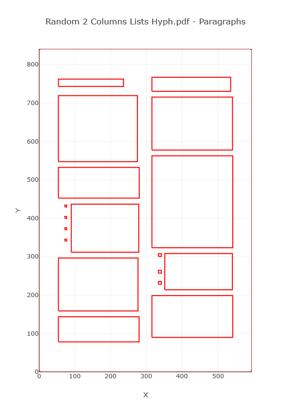

A simplified step-by-step implementation of the Docstrum algorithm for pdf documents

### How to run C# code in Jupyter Lab
https://devblogs.microsoft.com/cesardelatorre/using-ml-net-in-jupyter-notebooks/

# Description
From [_Performance Comparison of Six Algorithms for Page Segmentation_](https://www.researchgate.net/publication/220932988_Performance_Comparison_of_Six_Algorithms_for_Page_Segmentation): The Docstrum algorithm by Gorman is a __bottom-up__ approach based on __nearest-neighborhood clustering__ of connected components extracted from the document image. After noise removal, the connected components are separated into two groups, one with dominant characters and another one with characters in titles and section heading, using a character size ratio factor _fd_. Then, _K_ nearest neighbors are found for each connected component. Then, text-lines are found by computing the transitive closure on within-line nearest neighbor pairings using a threshold _ft_. Finally, text-lines are merged to form text blocks using a parallel distance threshold _fpa_ and a perpendicular distance threshold _fpe_. 

[wiki](https://en.wikipedia.org/wiki/Document_layout_analysis#Example_of_a_bottom_up_approach)

# Results
## 0.0 Open pdf document

## 0.1 Extract words and preprocess

## 1. Estimate within-line and between-line spacing
### 1.1 Within-line (between words) spacing

### 1.2 Between-line spacing

## 2. Get lines

## 3. Get paragraphs blocks

